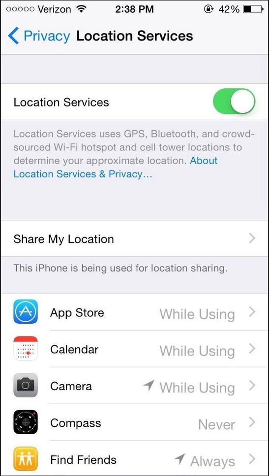

With the world becoming more and more connected via the internet, the ever changing global society that we now live, work and play in means we face new threats and concerns. Our lives are now online and unlike those generations before us taboos, and traditions, and instincts on for our privacy has not yet fully developed like the real world. The use of this technology is not free, we give up parts of our privacy to access websites, use social media, do online shopping, find jobs, and make use of GPS. Every time we use one of these platforms or tools, the data we give up in order to use it is collected and stored.

This data can then be used for a huge number of various reasons, some of these reasons are ethical, and some are not. Collected data is a very precious commodity that large companies such as the big five (Google, Facebook, Apple, Microsoft, and Amazon), or hackers want to gain access to. This could be done to make money by simply selling it on, holding it at ransom, or used to influence the online market via targeted adverts. 
This is all done without the vast majority of online users having any protections against their data being collected. This privacy guide will help you to be more private and safe when using the internet.

---
**Method One - Social Media Awareness**

There are many differnet ways to care for your online privacy. Social media can be a tool used for breaching privacy, and that this is usually down to the users own actions. While social media has opened up many new ground-breaking forms of social interactions and job opportunities, what users post to their feeds matter. A simple photo of your front door or location check-in could lead to an attempted burglary. In order to incrase your level of privacy, make sure that you are not sharing your location, posting your frequent whereabouts, or sharing posts that could be used to hurt you in the future (watch your digital footprint.) In some more hardcore cases you may want to delete your social media profiles on platforms such as Faceboook, Instagram, or twitter. This is however a "trade" scenario, you will gain increased privacy, but lose access to social media. This could lead to being left out of social events, or even job opportunities. Being aware of what you post, and where you post it is crucial in protecting your online privacy.

---
**Method Two - Location Services**

A lot of the apps and services we use today may now ask or in some cases even require the user to have their location services turned on. Depending on what you're doing and the reason the app uses these services, it is always good privacy practice to regulate what apps you give this permission to, and remeber to turn your location services off when not needed. Your location services can be found in the settings on your phone. It is also a good idea to check what apps are requesting your location data as some of them can be pointless. 
 

---
**Method Three - Password Management**

Making sure that your accounts are secure with a strong password is not only vital to your online privacy, but also to your general cyber secuirty. If you password is weak it can easily be cracked and used to gain access to your account. This is also the reason why you should **never use the same password for different accounts** A long and memorable phrase with some special charcters, such as numbers or symbols is the best practise for secure passwords.
Making use of a password generator, that generates strong passwords is also a good idea. These will however, be harder to remember and may therefore require a password manager. 

A password manager is simply put, an app or program that store your passwords securely. Some password managers will be better than others, some may require a subscription, and some will be more trustworthy. A good password managers needs to do a number of things, these are:
- Have military grade encryption 
- Generate strong passwords
- Save your other data such as payment information
These key points are what make a good password manager. A few recommendations are NordPass, and Bitwarden.
Keep in mind that a "master password" will be needed to use a password manager. So either spend some time thinking of a strong one or make use of a generator.

